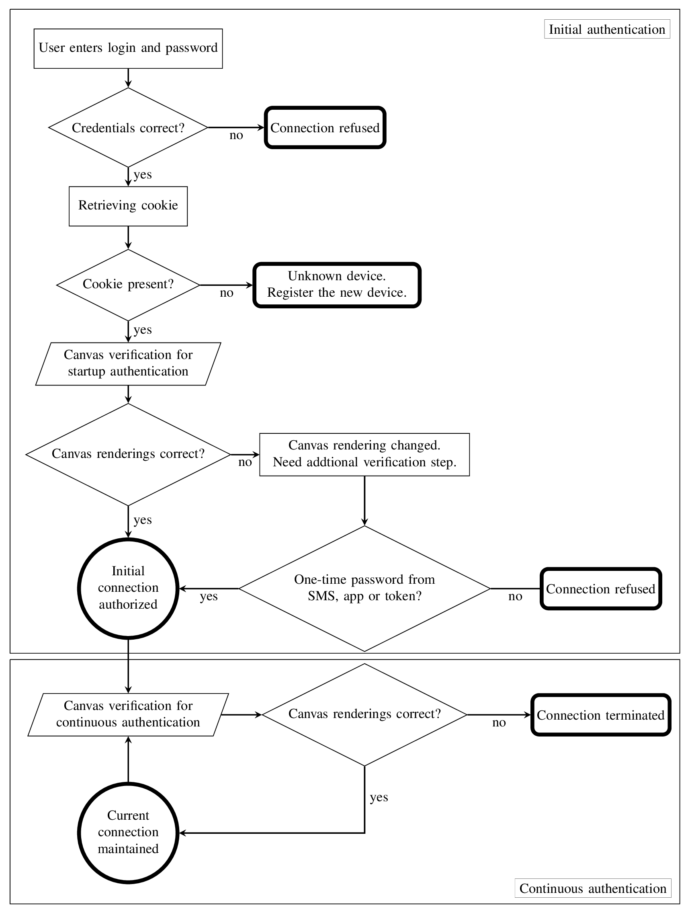

## Example of a complete MFA scheme

The figure below gives a concrete example of how our canvas mechanism can be used on 
top of an already existing authentication scheme to reinforce its security. During the login 
process, our protocol will be executed as an additional means of protection to make sure that 
the presented device can produce canvas renderings that match the ones sent during a previous 
connection. In case of a mismatch, the server will ask for an additional confirmation through 
a SMS or an app as can be seen in many web services enforcing double-factor authentication. As 
an added benefit, our mechanism can also be used to prevent connection hijacking by sending 
new pairs of challenges from time to time to verify the identity of the client.

