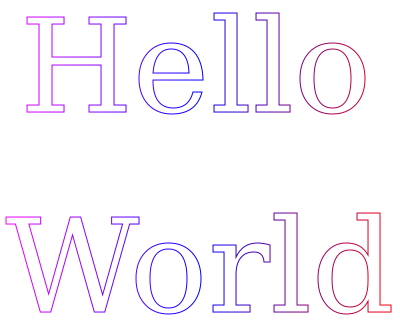
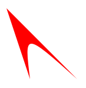
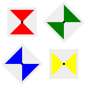
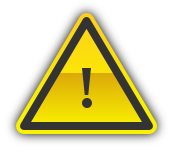
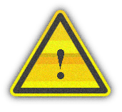
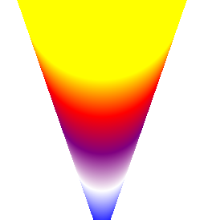
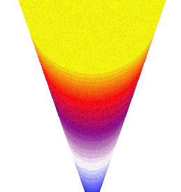
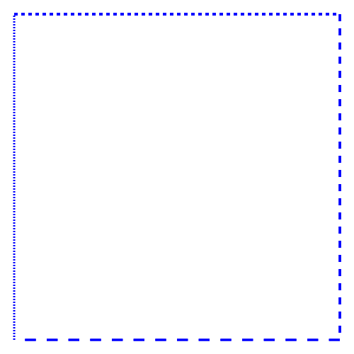

## Phase 1 of the canvas API study

The first phase of the canvas API study consisted of 15 tests designed to find 
distinctive features in a canvas rendering. We tried different shapes with 
different effects for geometric figures and we modified several parameters like 
the size, the color or the use of stroke for the rendering of strings.
The entropy for each test is given in bits. If every collected fingerprint presents 
a unique rendering, the maximum observable entropy for a test from our dataset of 
more than 15,000 fingerprints is 13.87 bits. 

| Test | Entropy (bits) | Size (WxH)| Image |
| :-----: |:-------------:| :-----: | :-----: |
| 1    | 6.87 | 278x27 |   |
| 2    | 6.99 | 389x43 |   | 
| 3    | 7.19 | 361x41 |   |
| 4    | 6.87 | 358x50 |   |
| 5    | 6.09 | 153x45 |   |
| 6    | 6.52 | 217x60 |   |
| 7    | 7.30 | 400x327|   |
| 8    | 4.15 | 400x60 |   |
| 9    | 2.32 | 201x60 |   |
| 10   | 4.89 | 80x80  |   |
| 11   | 4.14 | 146x149|   |
| 12   | 4.66 | 177x179|   |
| 13   | 6.85 | 171x157|   |
| 14   | 5.46 | 259x275|   |
| 15   | 4.47 | 500x500|   |

Test n°1 to n°7 are renderings of strings with different fonts, colors and sizes. 
The string in test n°6 is rendered with a stroke (only the contours are defined). 
Looking at the entropy, it is slightly lower than test n°5 so the use of stroke should be avoided.
Test n°7 is the same as the 6th one but bigger. 
The entropy gives a clear signal that size does matter and a clear and well-defined figure definitely helps in distinguishing devices.
Tests n°8 to n°15 are different attempts to draw a wide range of figures. 
The entropy of all these tests are lower than the ones with a string except for two: test n°14 with a gradient and test n°13 which combines both a gradient and a string with an exclamation mark. 
Depending on the device, the transition between colors can be smooth and natural or it can be clearly marked with a grainy texture on the whole surface. 

In the end, a **large image** with both **a string** and **a gradient** appears in our analysis as the right combination in a test to distinguish the maximum number of devices.