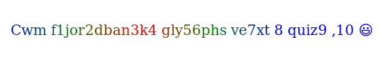
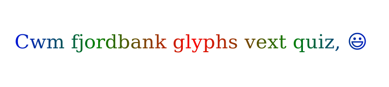
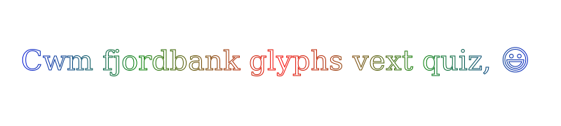
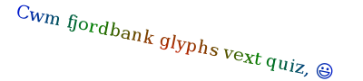
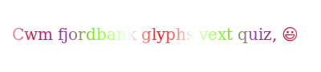

## Phase 2 of the canvas API study

The second phase of our study also consisted of 15 tests but the focus was put on the 
types of renderings observed in the first phase that provided the most diversity 
between devices. We studied variations on rendered strings and on gradients.
If every collected fingerprint presents a unique rendering, the maximum observable 
entropy for a test from the dataset of this second phase of more than 21,000 fingerprints 
is 14.37 bits.

| Test | Entropy (bits) | Size (WxH)| Image |
| :-----: |:-------------:| :-----: | :-----: |
| 1 | 7.69  | 400x90 |   |
| 2 | 7.15  | 400x90 |   |
| 3 | 7.76  | 400x90 |   |
| 4 | 7.73  | 535x90 |   |
| 5 | 8.32  | 800x180|   |
| 6 | 7.66  | 800x180|   |
| 7 | 7.21  | 400x90 |   |
| 8 | 7.64  | 400x90 |   |
| 9 | 7.68  | 400x90 |   |
| 10 | 7.70 | 400x90 |   |
| 11 | 7.69 | 400x90 |   |
| 12 | 7.70 | 400x90 |   |
| 13 | 7.74 | 400x90 |   |
| 14 | 7.59 | 400x90 |   |
| 15 | 7.69 | 400x90 |   |

Test n°1 is the base rendering for our second phase: a string with an emoji and a radial gradient.
Test n°2 applies a stroke effect to the rendered string.
Test n°3 renders the exact same string as the base one but in a reversed order.
The goal of test n°4 is to study the impact of strings' length. 
Here, a longer string does not necessarily mean a higher entropy.
Test n°5 doubles the size of the string of the base rendering. 
Bigger strings lead to more differences between devices making the entropy of this test the highest of this second phase.
Test n°6 combines a bigger string with a stroke effect.
Test n°7 applies a rotation to the rendered string.
Test n°8 changes the fallback font to the Arial font which is common in modern operating systems.
Test n°9 changes the three colors used in the gradient of the base rendering.
Test n°10 changes the position of the three colors of the base gradient.
Test n°11 increases the number of colors in the gradient.
Test n°12 switches from a radial gradient to a linear gradient.
Test n°13 tries a more complex linear gradient with a higher number of points.
Test n°14 changes the position of the radial gradient in the canvas element.
Test n°15 switches the emoji of the base test to another standard one.
